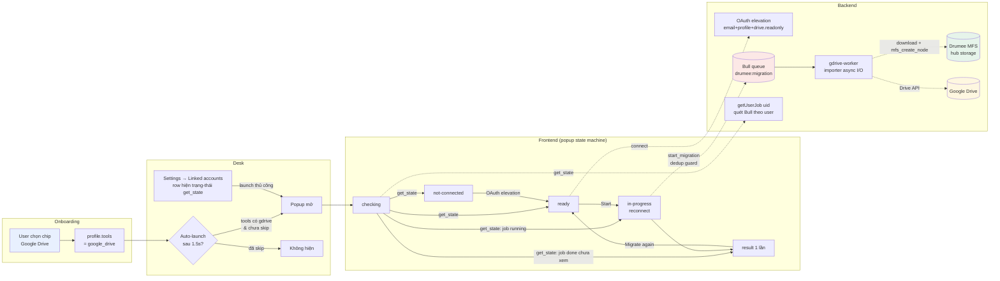
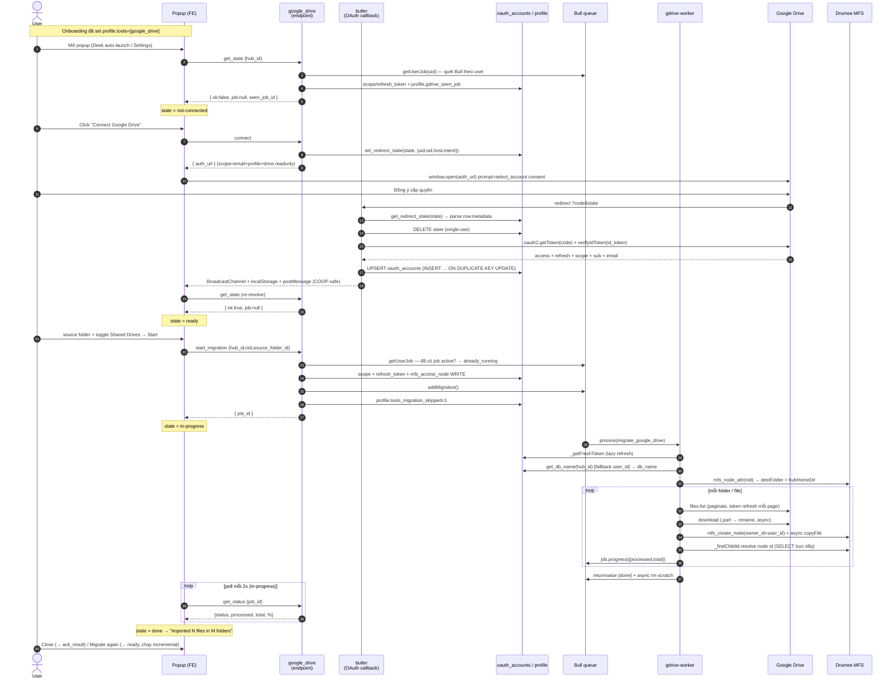
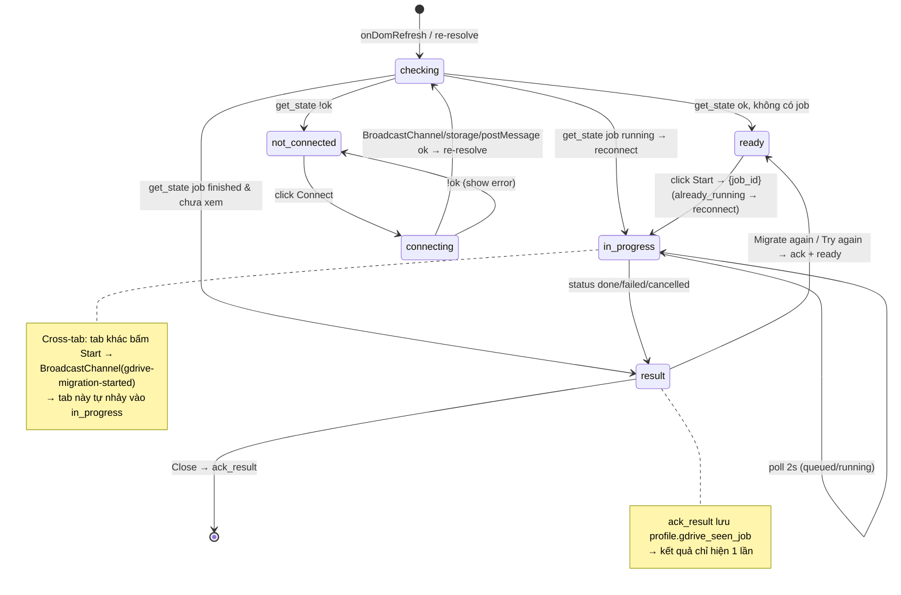
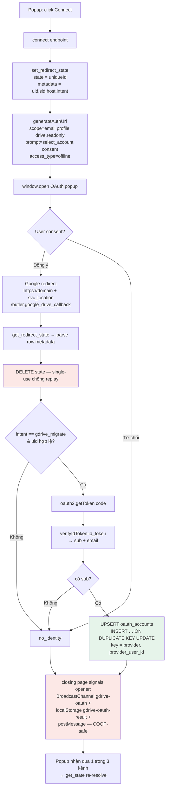
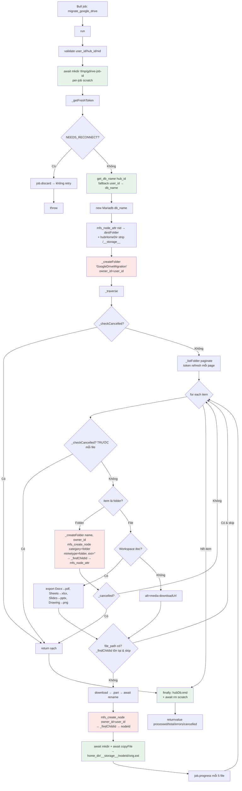
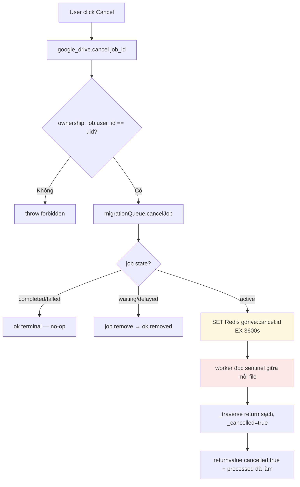
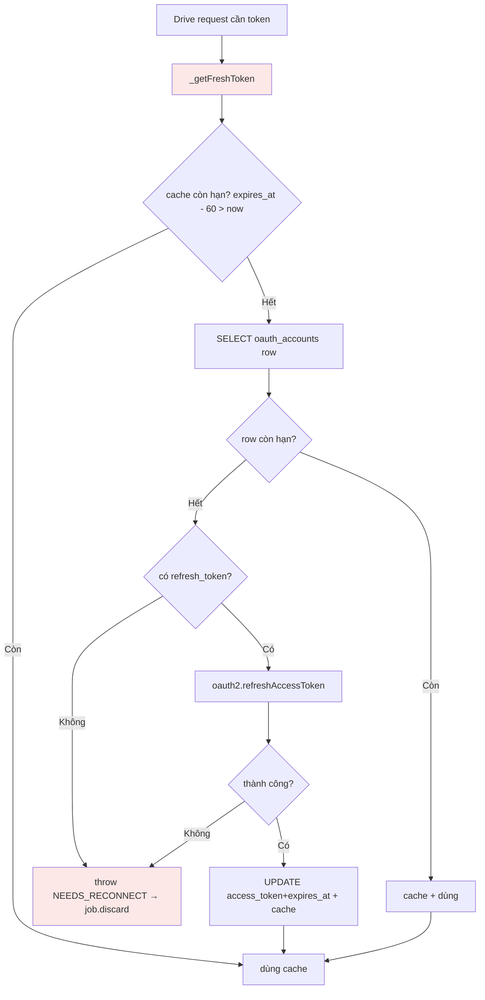

# Google Drive Migration — Workflow

> Import file/folder từ Google Drive vào Drumee workspace.
> Tài liệu cho team (PO, FE, BE, QA) — Mermaid render trực tiếp trên GitHub/GitLab.
> Phản ánh hiện trạng code **sau loạt fix 2026-05-29** (OAuth/upsert, reconnect, re-migrate, async I/O).

---

## 0. Bức tranh tổng thể

---

## 1. End-to-end sequence (happy path)

---

## 2. Popup state machine (Frontend)

> Nguồn sự thật của trạng thái là **Bull queue** (server). Popup mở lên gọi **`get_state`** để reconnect job đang chạy / hiện kết quả vừa xong — KHÔNG mặc định về "Start".

---

## 3. OAuth elevation sub-flow

> Drive migration dùng **OAuth client riêng** (`/etc/drumee/credential/google/drive.json`), tách khỏi client sign-in. Scope xin `email profile drive.readonly` — `email/profile` để callback lấy `sub` (provider_user_id) cho upsert; `drive.readonly` để đọc Drive.

**Vì sao 3 kênh tín hiệu:** màn consent của Google ship `Cross-Origin-Opener-Policy` → cắt `window.opener` của popup → `postMessage` về opener im lặng. BroadcastChannel + localStorage `storage` event (same-origin, sống sót opener bị cắt) đảm bảo app vẫn nhận. `redirect_uri` build từ `svc_location` (endpoint-aware) và **byte-identical** giữa `connect` (generateAuthUrl) và callback (getToken) — phải khớp giá trị đăng ký trong Google Console.

---

## 4. Worker / Importer internal flow

> Bull là nguồn sự thật. `mfs_create_node` qua connection của worker là CALL-with-OUT → **kết quả trả về không tin được** (mảng `[resultSet, okPacket]`); luôn resolve id qua **SELECT trực tiếp `media`** (`_findChildId`) rồi `mfs_node_attr`. Mọi fs I/O **async** (threadpool) để không chặn event loop → tránh Bull stall.

**Các ràng buộc đã học (đừng tái phạm):**
- `get_db_name(id)` resolve db_name (drumate **hoặc** hub). Proc `entity_exists` KHÔNG tồn tại.
- `mfs_create_node` cho folder/file cần `owner_id` **hợp lệ** (= user_id) — NULL → proc rollback ngầm. Folder cần `mimetype:'folder'` (cột `media.mimetype` NOT NULL).
- Resolve id qua `_findChildId` (SELECT `media` WHERE parent_id+user_filename), KHÔNG đọc `.id` từ return của `mfs_create_node`.
- fs I/O async (`fsp.copyFile/mkdir/rename/stat/rm`) — `cpSync`/`rmSync` đồng bộ chặn loop → Bull "stalled".

---

## 5. Cancellation flow

---

## 6. Token lifecycle

---

## 7. Reconnect, re-migrate & Settings integration

> Trạng thái migration thuộc Bull (persistent), không phải instance popup. Đóng popup / rời Settings / reload / tab khác đều reconnect được.

- **`get_state`** (gọi lúc popup mở **và** lúc Settings load): `{ ok: <có drive scope>, job: <getUserJob shaped|null>, seen_job_id: profile.gdrive_seen_job }`.
- **`getUserJob(uid)`**: quét job Bull (bounded) lọc theo `job.data.user_id`, ưu tiên đang chạy, else finished mới nhất.
- **Reconnect**: job running → popup vào thẳng `in-progress` + poll (không hiện "Start").
- **Show-once**: job finished & `job_id != seen_job_id` → hiện kết quả 1 lần; `ack_result` (đóng từ màn result) set `profile.gdrive_seen_job`.
- **Dedup**: `start_migration` nếu đã có job active → trả `{job_id, already_running:1}` (không tạo trùng).
- **Re-migrate** (incremental, chỉ file mới — skip file đã có): màn result có **"Migrate again"** (done/cancelled) / **"Try again"** (failed) → `_restart` → ready → Start.
- **Cross-tab**: tab Start → BroadcastChannel `gdrive-migration-started` → tab khác đang ở ready tự vào in-progress.
- **Settings row** ("Migrate from Google Drive"): load Settings → `get_state` → row hiện "Migration in progress — X/Y (NN%)" + nút **"View progress"** khi đang chạy; "Migrate again" nếu đã từng migrate; "Start migration" nếu chưa. Nút dùng **style ghost chung** (giống pill "Coming soon").

---

## 8. Phân chia trách nhiệm (component map)

| Layer | File | Trách nhiệm |
|---|---|---|
| Onboarding | `onboarding-ui/app/skeleton/toolkit/form.js` | Chip "Google Drive" → `profile.tools` |
| Auto-launch | `ui-team/.../modules/desk/index.js` | Mở popup khi user dùng GDrive & chưa skip |
| Popup UI | `ui-team/.../widget/migrate-gdrive-popup/` | State machine + get_state reconnect + form + progress + re-migrate |
| Settings | `ui-team/.../widget/settings/main/` | Re-entry + row hiện trạng thái migration (get_state on load) |
| Endpoint | `server-team/service/private/google_drive.js` | has_drive_scope, connect, start_migration (dedup), get_status, **get_state**, **ack_result**, cancel, dismiss |
| OAuth callback | `server-team/service/butler.js` | google_drive_callback — getToken + verifyIdToken + UPSERT + closing page (3 kênh) |
| Queue | `server-team/offline/queues/migrationQueue.js` | Bull add/status/cancel/stats + **getUserJob** + sentinel + lock settings |
| Worker | `server-team/offline/workers/gdriveWorker.js` | Drain queue (concurrency 2), pm2-managed (**restart riêng** sau khi sửa importer) |
| Importer | `server-team/offline/workers/gdrive/importer.js` | Traverse → download → MFS node (async I/O, _findChildId, owner_id+mimetype) |
| Base lib | `server-team/service/lib/ext_import.js` | Token refresh + import helpers |
| ACL | `acl/google_drive.json`, `acl/butler.json` | Routes + permissions (scope=hub, owner) |

---

## 9. Trạng thái & giới hạn

**Đã có:**
- Full pipeline onboarding → OAuth elevation → queue → worker → MFS (đã chạy thật: 446 file / 7 folder OK).
- Folder recursion + pagination (1000/page) + Shared Drives + Workspace export.
- Progress / cancel / retry (3 attempts, exp backoff).
- **Reconnect** job đang chạy (đóng/reload/tab khác) + show-once kết quả + **re-migrate incremental**.
- Settings row phản ánh trạng thái migration lúc load.
- **Chọn folder/file cụ thể** (Selected mode) qua cây lazy-load — xem section 11.
- Async fs I/O + Bull lock tolerance (lockDuration 60s, maxStalledCount 3) → chống "job stalled".

**Chưa có (Phase 2):**
- Conflict policy `overwrite` / `rename` (chỉ `skip` → file **đã sửa** trên Drive KHÔNG được cập nhật, chỉ thêm file mới).
- Resume per-file sau crash (retry/re-run chạy lại từ đầu, dựa skip để bỏ qua file đã có).
- Real-time push (FE poll 2s; Settings row là snapshot lúc load).
- Live reconnect cross-device (chỉ cross-tab cùng browser qua BroadcastChannel; cross-device cần mở lại popup → get_state).
- **Home menu KHÔNG cập nhật live khi migrate xong.** Worker (offline) tạo node trực tiếp qua `mfs_create_node`, KHÔNG phát WS `media.new` → desk `workspace-list`/`workspace-item` (vốn refresh theo `media.new`) không thấy folder/file mới ngay. Node được tạo **đúng dưới home root** nên hiện khi home **re-fetch** (navigate/reload). Trường hợp home rỗng cũng vậy: sau migrate cần reload mới thấy "GoogleDriveMigration". → Phase 2: worker đẩy `media.new` qua Redis pub/sub → endpoint → user socket (hoặc FE tự refresh desk khi popup `done`).

## 10. Deploy

- **server-team**: thay đổi `service/*` (endpoint) → restart endpoint/service. Thay đổi **`offline/workers/gdrive/importer.js` hoặc `migrationQueue.js` lock settings → `sudo drumee restart gdrive-worker`** (process worker riêng, deploy KHÔNG tự restart). Google Console (client Drive) phải đăng ký đúng `redirect_uri` từ `svc_location` mỗi endpoint.
- **ui-team**: `npm run dev` (build+deploy) + **`pm2 restart vudangnt`** (endpoint cache bundle manifest lúc startup) + hard-reload trình duyệt.

## 11. Chọn folder/file cụ thể (Selected mode)

Màn hình `ready` có 2 chế độ (radio):
- **Migrate everything** (mặc định) — như cũ: duyệt từ `root` toàn My Drive, tôn trọng toggle *Include Shared Drives*.
- **Choose folders & files** — hiện cây thư mục lazy-load (My Drive only). Tick folder = cả subtree; tick file = file đó. **Không tri-state**: mở 1 folder đã tick thì các con hiện mờ ("included via parent") — muốn chọn lẻ con thì bỏ tick folder cha trước.

**Endpoint `google_drive.list`** (read-only, My Drive only):
- in: `{ folder_id='root', page_token? }` → out: `{ files: [{ id, name, is_folder, mime_type, size }], next_page_token }`.
- Token qua `ExtImport.ensureFreshToken('google')`; lỗi → `NEEDS_RECONNECT`. Phân trang `pageSize=200`, `orderBy=folder,name` (folder trước, rồi tên).

**`start_migration`** nhận thêm:
- `mode` ('all' | 'selected', default 'all').
- `selections` = `{ folder_ids:[], file_ids:[] }` (chỉ Selected; rỗng → `NOTHING_SELECTED`). All-mode bỏ qua `selections`; Selected-mode bỏ qua `source_folder_id`/`include_shared_drives`.
- Truyền tiếp vào job data qua `addMigration` (queue whitelist field → đã thêm `mode`/`selections`).

**Importer** (`run()`):
- `mode` thiếu/'all' → `_traverse` từ `source_folder_id` (tương thích ngược với job cũ).
- 'selected' → `_migrateSelected`: mỗi `folder_id` → `_getMeta` lấy tên → tạo subfolder cùng tên dưới `GoogleDriveMigration` rồi `_traverse` (cả subtree); mỗi `file_id` → `_getMeta` → `_importItem` thẳng vào root. `_getMeta` = Drive `files.get?fields=id,name,mimeType,size` (server tự lấy metadata, KHÔNG tin tên client gửi).

**FE state** (popup instance): `_migrateMode`, `_treeCache` (folderId→`{items,next_page_token}`), `_expanded`/`_checkedFolders`/`_checkedFiles`/`_loading` (Set). Tree re-render scoped qua `ensurePart('gdrive-tree').feed(require('./skeleton/tree')(this))`; Start disable khi Selected + chưa chọn gì (`_refreshStartState` set `data-disabled`, `_startMigration` cũng guard + alert `NOTHING_SELECTED`).

**Giới hạn (Phase sau):** Shared Drives KHÔNG hiện trong cây (chỉ áp dụng All mode). Không chọn lẻ file bên trong folder đã tick (phải bỏ tick cha). Tri-state include/exclude.
