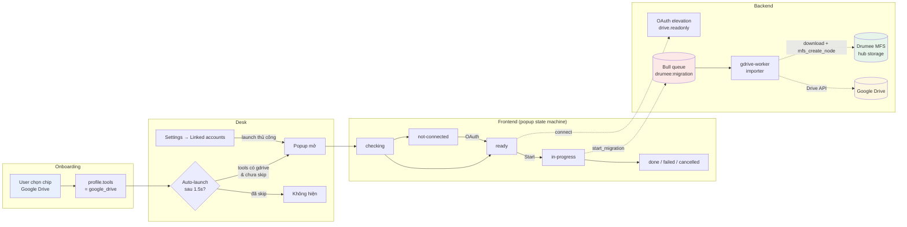
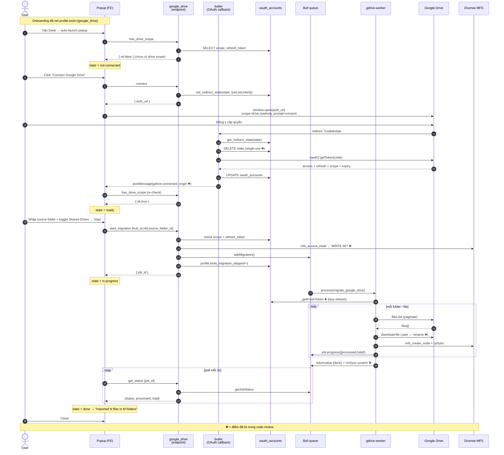
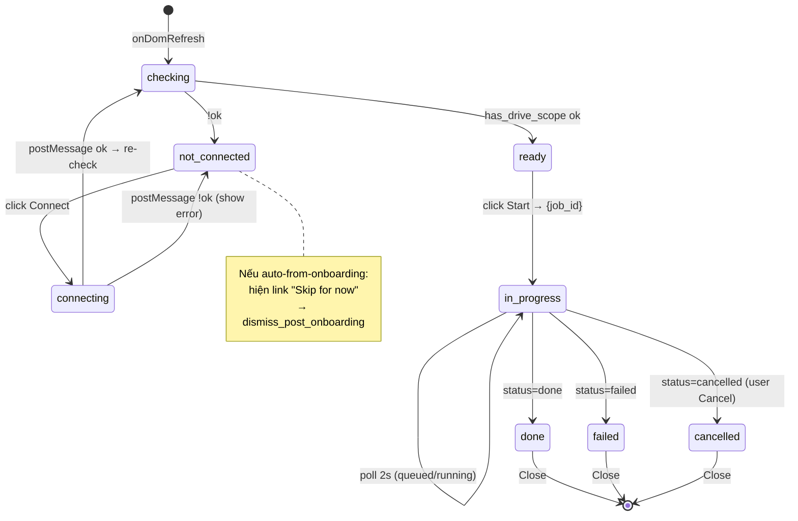
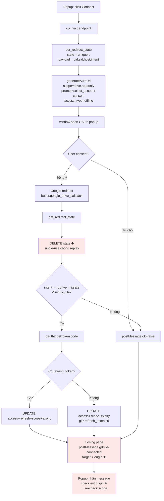
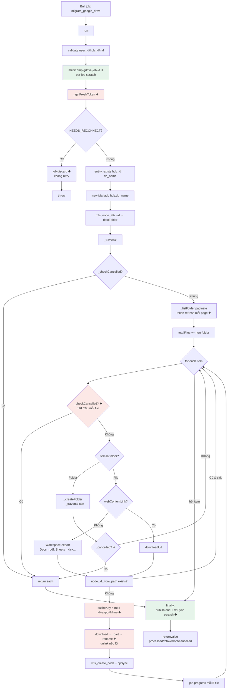
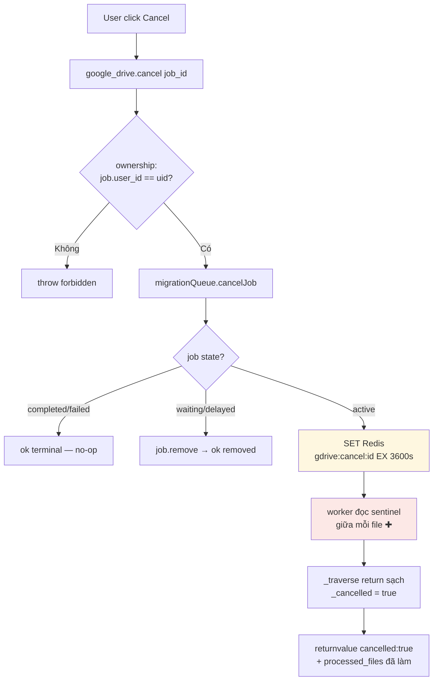
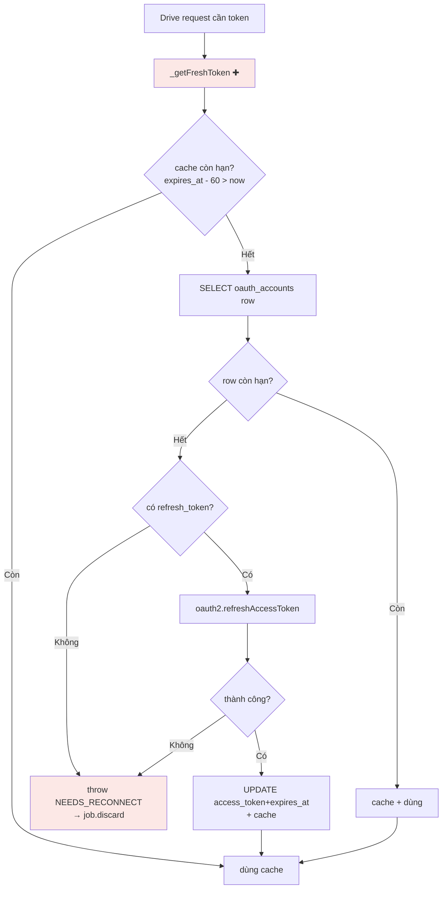

# Google Drive Migration — Workflow

> Import toàn bộ file/folder từ Google Drive vào Drumee workspace.
> Tài liệu này dành cho team (PO, FE, BE, QA) — các sơ đồ Mermaid render trực tiếp trên GitHub/GitLab.

---

## 0. Bức tranh tổng thể

---

## 1. End-to-end sequence (happy path)

---

## 2. Popup state machine (Frontend)

---

## 3. OAuth elevation sub-flow

> Sign-in chỉ xin `email profile`. Đọc Drive cần scope `drive.readonly` riêng → đây là bước "nâng quyền".

---

## 4. Worker / Importer internal flow

---

## 5. Cancellation flow

---

## 6. Token lifecycle

---

## 7. Phân chia trách nhiệm (component map)

| Layer | File | Trách nhiệm |
|---|---|---|
| Onboarding | `onboarding-ui/app/skeleton/toolkit/form.js` | Chip "Google Drive" → `profile.tools` |
| Auto-launch | `ui-team/.../modules/desk/index.js` | Mở popup khi user dùng GDrive & chưa skip |
| Popup UI | `ui-team/.../widget/migrate-gdrive-popup/` | State machine + form + progress |
| Settings | `ui-team/.../widget/settings/main/index.js` | Re-entry thủ công |
| Endpoint | `server-team/service/private/google_drive.js` | has_drive_scope, connect, start_migration, get_status, cancel, dismiss |
| OAuth callback | `server-team/service/butler.js` | google_drive_callback — đổi code→token |
| Queue | `server-team/offline/queues/migrationQueue.js` | Bull add/status/cancel/stats + sentinel |
| Worker | `server-team/offline/workers/gdriveWorker.js` | Drain queue (concurrency 2), pm2-managed |
| Importer | `server-team/offline/workers/gdrive/importer.js` | Traverse → download → MFS node |
| Base lib | `server-team/service/lib/ext_import.js` | Token refresh + import helpers |
| ACL | `acl/google_drive.json`, `acl/butler.json` | Routes + permissions (scope=hub, owner) |

---

## 8. Trạng thái & giới hạn (Phase 1)

**Đã có:**
- Full pipeline onboarding → OAuth → queue → worker → MFS
- Folder recursion + pagination (1000/page) + Shared Drives
- Workspace export (Docs→pdf, Sheets→xlsx, Slides→pptx, Drawing→png)
- Progress / cancel / retry (3 attempts, exp backoff)

**Chưa có:**
- Conflict policy `overwrite` / `rename` (chỉ `skip`)
- Resume per-file sau crash (retry chạy lại từ đầu)
- Real-time push (FE poll 2s)

**Demo:** happy path OK. Tránh: overwrite policy, Drive >1h (cũ), expect cancel tức thì (cũ).

> `✚` = 12 điểm fix trong code review (security/integrity/reliability/UX/resource).
